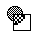

# How to Use Wacky Brushes

## Table of Contents

- [Overview](#overview)
- [Accessing Brushes](#accessing-brushes)
- [Available Brushes](#available-brushes)
  - [Pattern Brushes](#pattern-brushes)
  - [Line and Geometric Effects](#line-and-geometric-effects)
  - [Animated Brushes](#animated-brushes)
  - [Special Effects](#special-effects)
- [Tips and Tricks](#tips-and-tricks)
- [Combining Brushes](#combining-brushes)
- [Sound Effects](#sound-effects)

## Overview

Wacky Brushes are the heart of Kid Pix's creative magic. Each brush creates unique patterns and effects that would be impossible with traditional drawing tools.

## Accessing Brushes

1. Click the **Wacky Brush** tool (paintbrush icon) in the main toolbar
2. A submenu will appear showing different brush options
3. Click any brush icon to select it
4. Start drawing on the canvas

## Available Brushes

### Pattern Brushes

-  **Leaky Pen** - Simulates a pen running out of ink
-  **Dots** - Creates dot patterns along your path
-  **Bubbly** - Floating bubble patterns
-  **Pies** - Circular pie-slice patterns
-  **Rotating Dots** - Dots that spin as you draw

### Line and Geometric Effects

-  **Zig Zag** - Creates zigzag line patterns
-  **Connect The Dots** - Draws lines connecting your mouse path
-  **Geometry** - Mathematical geometric patterns
-  **XY to XY** - Coordinate-based line patterns

### Visual Effects

-  **Echoes** - Creates trailing echo effects
-  **Northern Lights** - Aurora-like streaming effects
-  **Kaliediscope** - Kaleidoscopic mirrored patterns
-  **Inverter** - Inverts colors where you draw
-  **3-D** - Creates 3D-looking effects

### Texture Brushes

-  **Fuzzer** - Fuzzy, soft-edged brush
-  **Spray Paint** - Simulates spray can texture
-  **Splatter Paint** - Random paint splatters
-  **Pine Needles** - Needle-like texture patterns

### Special Effects

-  **Magnifying Glass** - Magnifies areas of the canvas
-  **Swirl** - Spiral patterns that follow your mouse
-  **Starburst** - Radiating star patterns
-  **The Looper** - Creates looping patterns

### Themed Brushes

-  **Tree** - Draws tree-like branching patterns
-  **A Galaxy of Stars** - Star field patterns
-  **Lots of Hugs and Xs** - X and O patterns
-  **A Full Deck of Cards** - Playing card symbols
-  **Shapes and More Shapes** - Various geometric shapes
- **Paw Prints** 🐾 - Animal paw print patterns

## Brush Techniques

### Hold Shift for Larger Effects

- Most brushes become bigger when you hold Shift while drawing
- Try the same brush with and without Shift for variety

### Modifier Key Combinations

- Try holding **Alt**, **Ctrl**, or **Cmd** while drawing
- Different brushes respond to different modifier keys
- Some brushes change color, pattern, or behavior with modifiers

### Speed Effects

- Draw slowly for concentrated effects
- Draw quickly for lighter, more spread out patterns
- Some brushes react differently to fast vs. slow movements

## Pro Tips

- **Layer different brushes** - Use multiple brush types in one artwork
- **Combine with other tools** - Use brushes, then add lines or shapes
- **Experiment with colors** - Change colors between brush strokes
- **Listen to the sounds** - Each brush has unique audio feedback
- **Save your favorites** - Remember which brushes work well together

## Troubleshooting

- **Brush not working**: Make sure you've selected a brush from the submenu first
- **Effect too small**: Try holding Shift while drawing
- **Want to start over**: Use the Undo Guy or clear the canvas with the Moving Van
