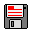
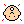

# Quick Start - Kid Pix User Guide

## Table of Contents

- [What is Kid Pix?](#what-is-kid-pix)
- [Getting Started](#getting-started)
  - [Using Kid Pix Online](#using-kid-pix-online)
  - [Using Kid Pix Locally](#using-kid-pix-locally)
- [Basic Drawing](#basic-drawing)
- [Exploring Tools](#exploring-tools)
- [Sound and Audio](#sound-and-audio)
- [Saving Your Work](#saving-your-work)
- [Tips for Fun](#tips-for-fun)
- [Troubleshooting](#troubleshooting)
- [Next Steps](#next-steps)

## What is Kid Pix?

Kid Pix is a playful digital painting program that recreates the magic of the classic 1989 Kid Pix software. It's designed for creative expression with whimsical tools, sound effects, and delightful surprises. Whether you're 8 or 80, Kid Pix encourages experimentation and fun over precision.

## Getting Started

### Using Kid Pix Online

1. Open your web browser and go to [kidpix.app](https://kidpix.app)
2. The Kid Pix canvas will load automatically
3. Start clicking on tools and drawing!

### Using Kid Pix Locally

1. Download or clone this repository
2. Install dependencies and start the development server:

```bash
yarn install
yarn dev
```

3. Open your browser and go to `http://localhost:5173`
4. Kid Pix will load and you can start creating!

_Note: You need a web server because the app loads JavaScript modules and audio files that browsers block when opening files directly._

## Basic Tools

The main toolbar on the left contains these essential tools:

-  **Save** - Download your artwork
-  **Wacky Pencil** - Draw lines with various pencil sizes
-  **Line** - Draw straight lines
-  **Rectangle** - Draw rectangles and squares
-  **Oval** - Draw circles and ovals
-  **Wacky Brush** - Access dozens of creative brushes
-  **Electric Mixer** - Apply wild visual effects
-  **Paint Can** - Fill areas with color or patterns
-  **Eraser** - Remove parts of your drawing (with fun effects!)
-  **Text** - Add letters and numbers with sounds
-  **Rubber Stamps** - Place pre-made graphics
-  **Moving Van** - Move parts of your drawing around
-  **Undo Guy** - Undo your last actions (up to 30 steps)
-  **Redo Guy** - Redo your last undone actions

## Pro Tips

- **Hold Shift** while using most tools to make them bigger
- **Try modifier keys** (Alt, Ctrl, Cmd) with tools for hidden features
- **Listen for sounds** - each tool has delightful audio feedback
- **Experiment freely** - there's no wrong way to use Kid Pix!

## Color Palette

- Click the **colored square** at the bottom left to see your current color
- Click any color in the palette below to select it
- Use the **← →** arrows to browse different color palettes

## Next Steps

- Try every tool at least once - they're all different!
- Explore the sub-menus that appear when you select certain tools
- Create something and save it to share with friends
- Check out the how-to guides for specific techniques
